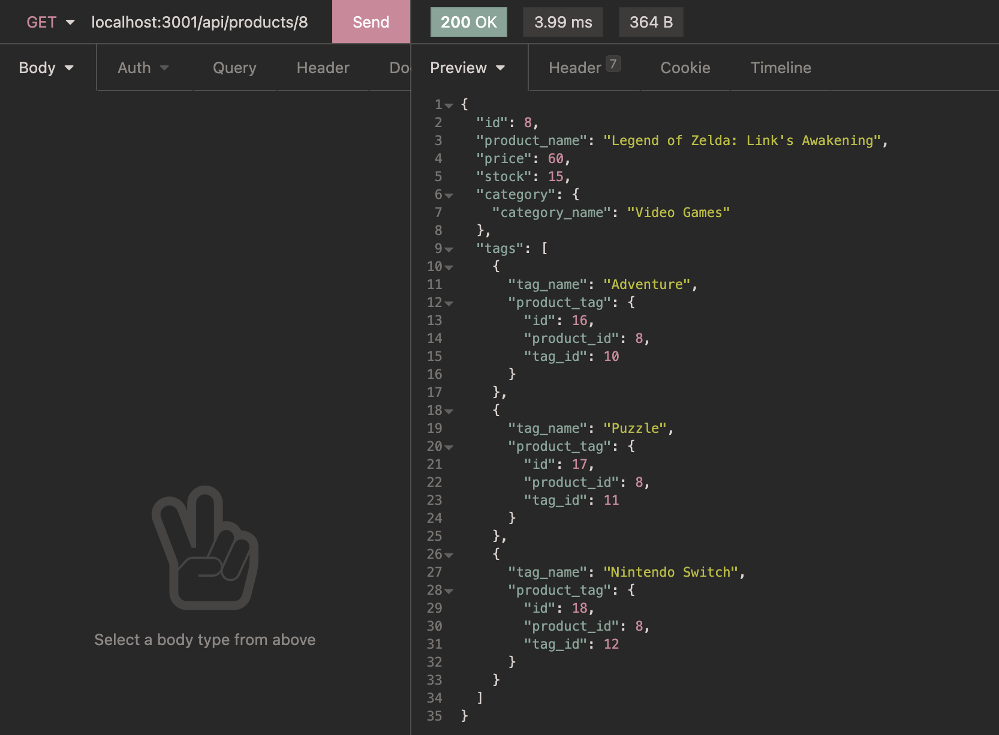

# e-Commerce Back End
## Purpose
Back-end for an e-Commerce website.
## Table of Contents
- [Built With](#built-with)
- [Installation](#instalaltion)
- [Usage](#usage)
- [Walkthrough](#walkthrough)
- [Contribution](#contribution)
## Built With
- Node.js
- Express
- MySQL
- Sequelize
- Insomnia
## InstallationTo install this application, the following steps must be taken:
1. Install Node.js
2. Clone this repository
3. Access repository directory through terminal
4. Install Express.js, MySQL2, and Sequelize by typing the following into the terminal: 
```
npm install
```
## Usage
To use this application, the following steps must be taken:

From the repository directory, in the terminal, type the following to start the server:
```
npm start
```
You are now able to test the API endpoints.
## Walkthrough
Please click on the following image to view a demonstration of the application: 

[](https://drive.google.com/file/d/1CLICogvXdMmAWTXR9ZSmGu-jYATtITKP/view?usp=sharing)
## Contribution
Created by CSM